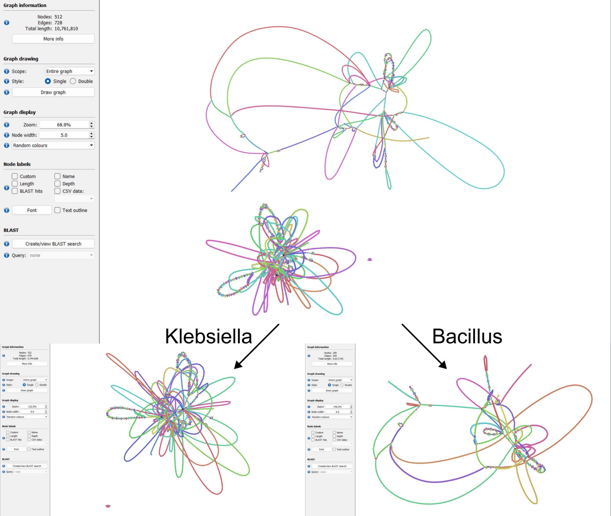

# separate_contaminated_assembly_graphs
Script which split assembly graphs into membership groups by taxon. This allows you to decontaminate multi-species assembly graphs into species-specific sub-graphs and assemblies. Will give you seperate `.gfa` and `.fasta` files for each taxa within your contaminated `.gfa` file. You decide the taxonomic level (`"kingdom", "phylum", "class", "order", "family", "genus", "species"`) for which to separate your assemblies.




## Motivation
Assemblies are often chimeric, in that they can be contaminated by multiple species. This is hard to de-convolute using fasta files. Hence, this script works on the connected memberships within the assembly graphs (`.gfa` files). It works by tagging contigs based on their taxonomic classification (via Kraken 2 and TaxonKit) and examining their linked, discrete membership components within the assembly graph. This allows clean, species-specific separation of contaminated assemblies. Would only recommend for "single" whole genome sequences. I have NOT tested this on metagenomic assemblies, but it may work!
Also multi-threaded and only loads the databases once to save time.


## Installation
1. Install software requirements
```bash
# Clone repository
git clone https://github.com/bananabenana/separate_contaminated_assembly_graphs

# Move to directory
cd separate_contaminated_assembly_graphs

# Use mamba (or optionally conda to install the required packages)
mamba env create -f environment.yml

# Activate environment
mamba activate separate_contaminated_assembly_graphs_env

# Test installation
python separate_contaminated_assembly_graphs.py -h
```


2. Install Kraken 2 database. Select from here: https://github.com/BenLangmead/aws-indexes/blob/master/docs/k2.md
```bash
# For example, the 2025 PlusPFP Kraken 2 database:
wget -c https://genome-idx.s3.amazonaws.com/kraken/k2_pluspfp_20251015.tar.gz
tar -zxvf k2_pluspfp_20251015.tar.gz
```

3. Download taxdump from NCBI
```bash
wget -c ftp://ftp.ncbi.nih.gov/pub/taxonomy/taxdump.tar.gz
tar -zxvf taxdump.tar.gz
```

You're now ready to start de-contaminating your assemblies!


## Quick usage
Separate suspected contaminated assemblies at the `family` level.
Note: This taxonomic rank is useful for distantly-related bacteria. I use this one the most.
```bash
python separate_contaminated_assembly_graphs.py \
  --gfa_directory test_data/assemblies/graphs \
  --fasta_dir test_data/assemblies/fastas \
  --output_dir separated_assemblies \
  --taxa_level "family" \
  --kraken2_db k2_pluspfp_20251015 \
  --taxonkit_db taxdump \
  --threads 12
```

Separate at the `species` level. I'd be careful with this one as it is database dependent. If a species is not well represented or there is interspecies recombination, this will result in mis-classification and incorrect assembly splitting. 
```bash
python separate_contaminated_assembly_graphs.py \
  --gfa_directory test_data/assemblies/graphs \
  --fasta_dir test_data/assemblies/fastas \
  --output_dir separated_assemblies \
  --taxa_level "species" \
  --kraken2_db k2_pluspfp_20251015 \
  --taxonkit_db taxdump \
  --threads 12
```

## Outputs

### Main files
Each assembly will be split into `{genome}_membership_n` prefixes, where n starts at `_1` to `_n`
- `{genome}_membership_1.fasta`: Fasta assembly of `_membership_1`
- `{genome}_membership_1.gfa`: Assembly graph of `_membership_1`
- `{genome}_membership_1.tsv`: Membership report of all contigs from `_membership_1`

In the test_data example, there is also:
- `{genome}_membership_2.fasta`: Fasta assembly of `_membership_2`
- `{genome}_membership_2.gfa`: Assembly graph of `_membership_2`
- `{genome}_membership_2.tsv`: Membership report of all contigs from `_membership_2`

We can see based off the initial `test_data/input/assemblies/graphs/SAMN46829665.gfa` that these formed discrete membership-connected graphs, so the tool was able to efficiently separate these out.

Note: This tool *can* split plasmids into their own membership group. You should check the output files manually and see if you can tie this to one of the split genomes. If you have two *Enterobacteriaceae* genomes, confidently assigning the plasmid to 1 assembly may be tricky!


### Intermediate files
*Felt cute, might delete later*
- `taxonkit_lineage.tsv`: Description of taxons at each taxonomic rank per contig. Output of TaxonKit
- `taxonkit_prep.tsv`: Input file for TaxonKit containing contig names and associated taxids
- `all_kraken_output.tsv`: Raw Kraken 2 output


## Requirements
Please see [installation instructions](#installation) for details. But:
- python=3.13.7
- Kraken 2=2.0.7-beta
    - Kraken 2 database
- TaxonKit=0.20.0
- Taxdump from NCBI


## Citation
To come


## Authors
- Ben Vezina
